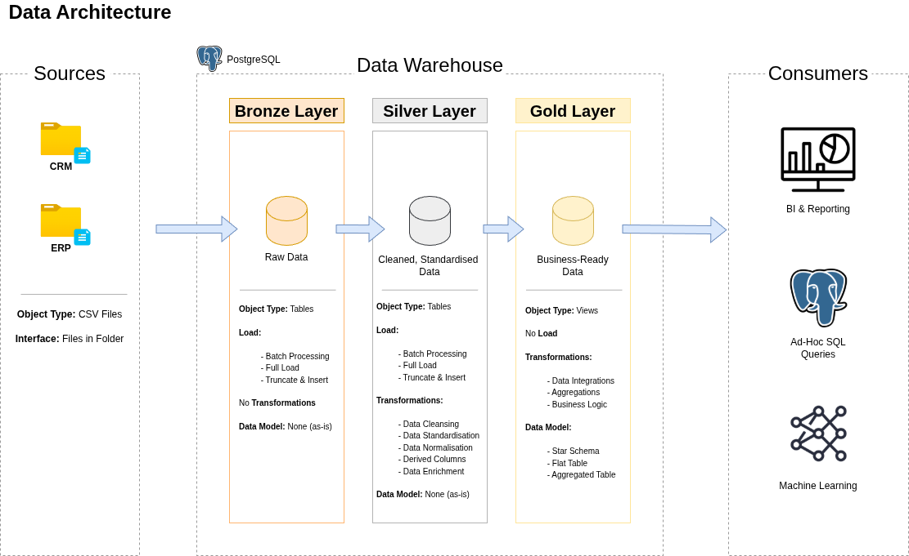
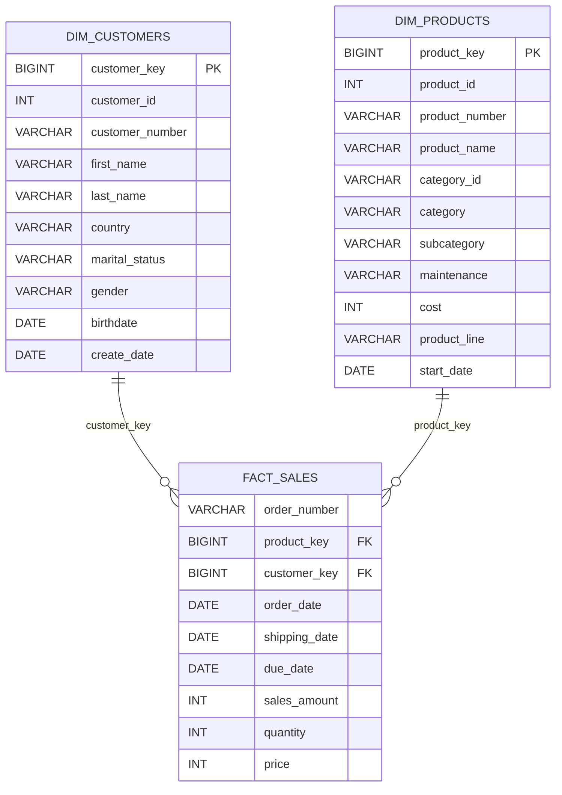

# Modern SQL Data Warehouse Project

## Overview

This project builds a modern SQL data warehouse using a medallion architecture.

The goal is to consolidate CRM and ERP sales data from CSV files, clean and standardise the data, and create a business-ready analytics model for reporting and analysis.

---

## Project Highlights

- Built a three-layer medallion data warehouse in PostgreSQL.
- Loaded CRM and ERP CSV data into source-aligned Bronze tables.
- Cleaned, standardised, deduplicated, and enriched data in the Silver Layer.
- Converted integer-formatted source dates into PostgreSQL `DATE` values.
- Derived product effective dates using window functions.
- Integrated CRM and ERP customer and product data.
- Built customer and product dimensions and a sales fact view.
- Added Silver and Gold data-quality validation scripts.

---

## Architecture

The warehouse follows a medallion architecture with three layers:



| Layer | Purpose |
| --- | --- |
| Bronze | Raw source-aligned data |
| Silver | Cleaned and standardised data |
| Gold | Business-ready analytics model |

---

## Gold Layer Data Model

The gold layer uses a dimensional model designed for analytical queries.



The Gold Layer is implemented via PostgreSQL views. The primary-key and foreign-key labels in the diagram represent logical dimensional relationships rather than physically enforced database constraints.

---

## Data Sources

| Source | Description |
| --- | --- |
| CRM | Customer, product, and sales transaction data |
| ERP | Customer demographic, location, and product category data |

---

## Repository Structure

```text
data-warehouse-project/
│
├── datasets/              # Source CSV files
│
├── docs/                  # Project documentation and diagrams
│   ├── data_architecture.png
│   ├── data_catalog.md
│   ├── data_flow.png
│   ├── data_integration.png
│   ├── data_model.png
│   └── naming_conventions.md
│
├── scripts/               # SQL scripts
│   ├── bronze/            # Bronze layer DDL and load scripts
│   ├── silver/            # Silver layer DDL and transformation scripts
│   └── gold/              # Gold layer views / data model scripts
│
├── tests/                 # Data quality and validation checks
│
├── README.md
├── LICENSE
└── .gitignore
```

---

## Project Documentation

- [Gold Layer Data Catalog](docs/data_catalog.md)
- [Naming Conventions](docs/naming_conventions.md)
- [Bronze Load Procedure](scripts/bronze/03_proc_load_bronze.sql)
- [Silver Transformation Procedure](scripts/silver/05_proc_load_silver.sql)
- [Gold Dimensional Model](scripts/gold/06_ddl_gold.sql)
- [Silver Quality Checks](tests/quality_checks_silver.sql)
- [Gold Quality Checks](tests/quality_checks_gold.sql)

---

## How to Run the Project

### Prerequisites

- PostgreSQL
- A PostgreSQL role permitted to create databases and schemas
- Permission to use server-side `COPY`
- Source CSV files available on the PostgreSQL server filesystem

### Execution Order

1. Run `scripts/00_create_database.sql` while connected to an administrative database such as `postgres`.
   - Warning: this script drops and recreates the `data_warehouse` database.
2. Connect to the new `data_warehouse` database.
3. Run `scripts/01_create_schemas.sql`.
4. Run `scripts/bronze/02_ddl_bronze.sql`.
5. Run `scripts/bronze/03_proc_load_bronze.sql`.
6. Execute the procedure, passing the absolute dataset directory on the PostgreSQL server:
```sql
CALL bronze.load_bronze('/path/to/datasets');
```
7. Run `scripts/silver/04_ddl_silver.sql`.
8. Run `scripts/silver/05_proc_load_silver.sql`.
9. Execute:
```sql
CALL silver.load_silver();
```
10. Run `tests/quality_checks_silver.sql`.
11. Run `scripts/gold/06_ddl_gold.sql`.
12. Run `tests/quality_checks_gold.sql`.

---


## Project Requirements

### Objective

Build a SQL data warehouse to consolidate sales data and support analytical reporting and informed decision-making.

### Specifications

- **Data Sources:** Import CRM and ERP data from CSV files.
- **Data Quality:** Clean and resolve data quality issues before analysis.
- **Integration:** Combine both source systems into a single analytics-ready model.
- **Scope:** Use the latest dataset only; historisation is not required.
- **Documentation:** Document the architecture, data flow, and final data model.

---


## Naming Conventions

| Object Type | Pattern | Example |
| --- | --- | --- |
| Schema | `<layer>` | `bronze`, `silver`, `gold` |
| Bronze table | `<sourcesystem>_<entity>` | `crm_cust_info` |
| Silver table | `<sourcesystem>_<entity>` | `crm_cust_info` |
| Gold dimension | `dim_<entity>` | `dim_customers` |
| Gold fact | `fact_<entity>` | `fact_sales` |
| Metadata column | `dwh_<column_name>` | `dwh_create_date` |
| Load procedure/script | `load_<layer>` | `load_bronze` |
| Gold aggregate | `agg_<entity>_<grain>` | `agg_sales_monthly` |

---

## Example Analytical Query

Total sales by customer country:

```sql
SELECT
    c.country,
    SUM(f.sales_amount) AS total_sales
FROM gold.fact_sales AS f
JOIN gold.dim_customers AS c
    ON f.customer_key = c.customer_key
GROUP BY c.country
ORDER BY total_sales DESC;
```

---

## Tools

- SQL
- PostgreSQL
- DBeaver
- GitHub
- Draw.io
- Notion

---

## Skills Demonstrated

- Data warehouse design
- Medallion architecture
- SQL development
- Data ingestion from CSV files
- Data cleansing and standardisation
- Data integration
- Dimensional modelling
- Data quality checks
- Technical documentation
- Git-based project organisation

---

## Credits & References

This project is based on a guided SQL data warehouse project by Data with Baraa.

1. [SQL Data Warehouse from Scratch](https://www.youtube.com/watch?v=9GVqKuTVANE) - Data with Baraa
